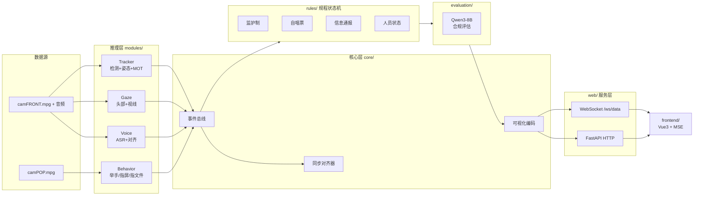

# Hedian · 核电站监护制合规检测系统

> 核电站主控室场景下的多模态合规性实时检测系统：分析 front（正面）与 pop（操作盘）两路音视频，判定操作人 / 监护人是否按规程执行监护制、自唱票与信息通报，并由大模型对完整流程的多模态证据链进行合规评估，前端流式可视化呈现。

| 后端 | Python 3.10 · FastAPI · Redis Stream+Hash · ffmpeg fMP4 |
|------|------|
| 前端 | Vue 3 · TypeScript · Vite · MSE 流式播放 |
| 感知 | YOLO11 检测 · YOLO26s 姿态 · OC-SORT 跟踪 · Qwen3-ASR 语音对齐 · Qwen3-8B 评估 |
| 代码规模 | 53 个 Python 模块 / 约 10,200 行 · 19 个前端源文件 |

---

## 目录

- [系统架构](#系统架构)
- [核心能力](#核心能力)
- [环境要求](#环境要求)
- [准备资源](#准备资源)
- [部署指南](#部署指南)
- [配置参考](#配置参考)
- [接口参考](#接口参考)
- [推送与交互逻辑](#推送与交互逻辑)
- [项目结构](#项目结构)
- [故障排查](#故障排查)
- [开发说明](#开发说明)
- [贡献指南](#贡献指南)
- [许可证](#许可证)

---

## 系统架构



**关键设计点**

- **事件总线解耦**：各推理模块只向总线发布事件，规程状态机被动消费，模块可独立增删。
- **视角级 GPU 分配**：`config.yaml` 按模块指定 GPU，tracker 与 voice/behavior/evaluation 分卡，避免显存争用。
- **推理解耦常驻**：`main.py` 以子进程拉起各推理流，Web 服务常驻；进程异常不影响 HTTP 面。
- **状态可回放**：Redis 记录推理与模块状态，WebSocket 连接时补发状态快照，前端刷新即恢复进度。

---

## 核心能力

| 模块 | 能力 | 说明 |
|------|------|------|
| Tracker | 人员追踪 | 目标检测 + 姿态估计 + 多目标跟踪，输出操作人 / 监护人身份 |
| Gaze | 眼睛关注度 | 头部姿态 + 视线估计，判定是否注视关键区域 |
| Voice | 语音转录 | 字词级时间对齐 + 行业术语归一化，支撑唱票比对 |
| Behavior | 行为检测 | 举手、手指屏幕、手指文件三类关键动作 |
| Rules | 规程判定 | 监护制 / 自唱票 / 信息通报 / 人员状态 四大状态机实时研判 + 违规告警 |
| Evaluation | 合规评估 | 大模型基于完整多模态证据链输出合规结论与打分 |
| Frontend | 流式可视化 | 视频、字幕、关注度热力图、告警实时推送，断点续看 |

---

## 环境要求

| 组件 | 要求 |
|------|------|
| Python | 3.10 |
| GPU | NVIDIA + CUDA，建议单卡 24GB 起；默认配置按视角分卡 |
| Redis | 6.x+，需支持 Stream 与 Hash |
| Node | 20（仅前端构建阶段） |
| ffmpeg | 系统可用（fMP4 转封装） |

---

## 准备资源

> 以下模型权重与输入视频不包含在代码仓库内，需按指定路径自行准备。判定逻辑的权威来源为 `rules/` 源码，规程细则与设计文档需向项目方单独获取。

### 模型权重 → `models/`

| 路径 | 用途 |
|------|------|
| `detection/yolo11_MOT.pt` | 人员检测（含 MOT 跟踪头） |
| `detection/yolo26s-pose.pt` | 姿态估计 |
| `behavior/behavior_yolo.pt` | 行为检测 |
| `behavior/behavior_yolo26s-pose.pt` | 行为姿态估计 |
| `gaze/yolov8n_head.onnx` | 头部检测 |
| `gaze/gazelle_dinov3_vits16plus_finetuned_1x3x640x640_1xNx4.onnx` | 视线估计 |
| `evaluation/Qwen3-8B` | 合规评估主模型 |
| `evaluation/Qwen2.5-1.5B-Instruct` | 备用评估模型 |
| `voice/qwen/Qwen3-ASR-0___6B` | 语音转录 |
| `voice/qwen/Qwen3-ForcedAligner-0___6B` | 字词级对齐 |

- Qwen 系列为公开模型，可从 ModelScope / HuggingFace 获取。
- YOLO 系列为项目训练产物，需自行训练或使用项目方提供的权重。

> ⚠️ **命名差异**：语音模型目录名用下划线（`Qwen3-ASR-0___6B`），而 `config.yaml` 中写的是带点形式（`Qwen3-ASR-0.6B`）。下载后必须核对并统一，否则启动即报错。

### 视频与标注 → `data/`

| 路径 | 说明 |
|------|------|
| `videos/camFRONT.mpg` | 正面视角视频，操作人 / 监护人入镜 |
| `videos/camPOP.mpg` | 操作盘视角视频 |
| `videos/camFRONT_audio.wav` | 正面视角音频轨 |
| `ROI.json` | 关键区域标注，关注度判定依据 |
| `results/` | 推理结果输出目录（需可写） |

样本数据为本项目自采，无法随仓库发布。替换为自有视频后须同步修改 `config.yaml` 的 `videos.*`。

### Redis 实例

建议使用**专用 Redis**：`/start` 接口会执行 `flushdb` 清空全部 key 以保证运行幂等，请勿与业务服务共用实例。

---

## 部署指南

### 1. 获取代码

```bash
git clone <your-repo-url>
cd <your-repo-dir>
```

后续命令均在仓库根目录执行。

### 2. 安装依赖

```bash
conda create -n hedian python=3.10 -y
conda activate hedian
pip install -r requirements.txt
```

### 3. 放置资源

按 [准备资源](#准备资源) 补齐 `models/` 与 `data/`，并核对 `config.yaml` 中所有路径指向真实文件。

### 4. 启动后端

```bash
python main.py --gpu 0            # 前台，便于观察日志
python main.py --config custom.yaml --gpu 0   # 指定配置
```

常驻部署：

```bash
setsid nohup python main.py --gpu 0 > hedian.log 2>&1 < /dev/null &
```

### 5. 构建前端

```bash
cd frontend
npm install
npm run build
```

构建产物**不入版本库**（`frontend/dist/` 已加入 `.gitignore`），克隆仓库后必须执行本步才能在浏览器访问页面。产物由后端以静态文件兜底方式托管，无需独立部署 Web 服务器。

### 6. 验证

```bash
curl http://127.0.0.1:5002/status      # 期望 {"pipeline":"idle", "ws_clients":0}
curl -X POST http://127.0.0.1:5002/start
curl http://127.0.0.1:5002/api/modules  # 确认各模块开关
```

浏览器访问 `http://<服务地址>:5002`。

### 停止 / 复位

```bash
curl -X POST http://127.0.0.1:5002/stop    # 终止推理子进程，切回 idle
curl -X POST http://127.0.0.1:5002/reset   # 同时清空 Redis 与可视化缓存
pkill -f main.py                            # 直接结束服务
```

---

## 配置参考

`config.yaml` 主要字段：

| 字段 | 默认 | 说明 |
|------|------|------|
| `app.port` | `5002` | Web 服务端口 |
| `app.gpu_map` | 按模块分卡 | **单卡环境请将值 `"1"` 改为 `"0"`** |
| `app.gpu_default` | `"0"` | `gpu_map` 未覆盖模块的回退值，含 CLI `--gpu` |
| `app.fps` | `30.0` | 帧率基准 |
| `redis.host` / `port` / `db` | `localhost` / `6379` / `0` | Redis 连接 |
| `paths.data_root` | `data` | 数据根目录 |
| `paths.model_root` | `models` | 模型根目录 |
| `paths.result_root` | `data/results` | 结果输出目录 |
| `videos.front` / `pop` | 见仓库 | 输入视频路径 |
| `voice.asr_engine` | `qwen3` | 语音识别引擎 |
| `voice.model_path` / `aligner_path` | 见仓库 | 语音模型路径 |
| `supervision.*` | 见仓库 | 监护制绑定的时长与距离阈值、连续帧数、告警冷却 |
| `tracker.detection.*` | 见仓库 | 检测置信度、NMS、输入尺寸 |
| `gaze.*` / `behavior.*` | 见仓库 | 关注度与行为判定的置信度、IoU、冷却参数 |
| `bus.max_queue_size` | `1024` | 事件总线队列上限 |
| `modules.*` | `true` | 各感知模块开关，未备齐资源的模块可置 `false` |
| `rules.*` | `true` | 各规程状态机开关 |

---

## 接口参考

### HTTP

| 方法 | 路径 | 说明 |
|------|------|------|
| POST | `/start` | 启动流水线。幂等：运行中重复调用返回 `already_running`；启动前 `flushdb` 清空历史 |
| POST | `/stop` | 终止推理子进程，清理 `inference:*` / `module:*` / `pipeline:*`，状态切回 idle |
| POST | `/reset` | 页面刷新场景：终止进程 + `flushdb` + 清空可视化缓存 |
| GET | `/status` | 返回 `{pipeline, ws_clients}` |
| GET | `/api/config` | 返回当前生效的完整配置 |
| GET | `/api/modules` | 返回模块开关 |
| GET | `/api/video/front` | 流式下发正面视角视频（HTTP Range 206 硬解） |
| GET | `/api/video/pop` | 流式下发操作盘视角视频 |

静态资源兜底至前端 `dist/`（需先执行部署指南第 5 步构建），并强制 `no-cache` 响应头，避免部署后取到旧产物。

### WebSocket `ws://<host>:5002/ws/data`

- **下行**：服务端推送推理事件、字幕、关注度与告警数据；连接建立时补发状态快照，刷新页面即可恢复进度。
- **上行**：客户端上报播放进度 `{ "type": "playback_progress", "current_sec": 12.5 }`，用于多端同步。

---

## 推送与交互逻辑

从"事件产生"到"界面呈现"的完整链路，含各面板的同步语义与推送时机。

### 消息通道总览

WebSocket 同时承载两类下行负载：

| 通道 | 形态 | 内容 |
|------|------|------|
| 视频流 | 二进制帧 | `[1 字节 channel][1 字节 type] + fMP4 段`；channel 区分 front / pop，type 区分 init / media / end |
| 结构化数据 | JSON 文本 | 事件 batch（流程、字幕、人数、凝视）与评估报告（流式、终态） |

上行仅有播放进度，除多端同步外，还参与**评估报告的推送时机判定**（见下文）。

前端路由链为 **WS → media 内核 → `usePlayback` 路由 → 业务 store**：batch 中的 `flow_start` / `flow_end` 分派给通知栏，`voice` 分派给字幕池，`tracking` / `gaze` 分派给状态量；评估报告走独立回调直达报告 store。

### 流程（flow）生命周期

"流程"指一次完整的规程执行片段（如一次监护制绑定）。由规则层状态机识别边界，并分配唯一 `flow_id`：

- **开始**：判定流程成立 → 发布 `FLOW_STARTED`；
- **结束**：判定流程终止 → 发布 `FLOW_ENDED`，附带 `flow_continue_sec`（持续时长）。

流程类型仅三种：`supervision`（监护制）、`self_ticket`（自唱票）、`info_notice`（信息通报）。

同步中间件把这两类事件转为 batch 元素下发：

```jsonc
// flow_start
{ "localSec": 123.4, "tag": "flow_start",
  "data": { "flow_type": "supervision", "flow_start_sec": 123.4 } }

// flow_end
{ "localSec": 156.7, "tag": "flow_end",
  "data": { "flow_type": "supervision", "flow_end_sec": 156.7, "flow_continue_sec": 33.3 } }
```

### 系统通知栏

通知栏内是**两套不同的同步语义**，这是最容易误解的一点：

| 类别 | 内容 | 同步语义 |
|------|------|----------|
| 状态量 | 监控室人数、凝视状态 | **实时**：后端对齐后立即推送，前端收到即显示，不等播放进度 |
| 事件流 | 流程开始 / 结束列表 | **跟画面**：仅显示 `时刻 ≤ 当前播放秒数` 的条目 |

- **监控室人数**：`≥3` 绿 / `1–2` 黄 / `0` 红；
- **凝视状态**：专注人数 `≥2` 绿 / `1` 黄 / `0` 红；未注视 ROI 时额外显示离岗进度条（**以 60 秒为满格**），达到 60 秒转红并加 ⚠️；
- **流程事件**：渲染为 `[时刻] 流程名开始/结束`，按类型着色——监护制 `#00d4ff`、自唱票 `#ffaa00`、信息通报 `#00ffcc`；同类型、同时刻（±0.1 秒）、同起止的重复事件会被去重。

状态量走实时是为了让监控者**立刻**看到异常，不必等播放追上；事件流跟画面是为了让流程标记**与视频对齐**，便于回看定位。

### 评价报告的推送逻辑

报告**不是流程一结束就推给前端**，而是刻意等待前端播放到流程结束时刻，使报告与画面同步出现。完整时序：

1. 规则层发布 `FLOW_ENDED` → 评估管理器**提交后台线程池异步评估**，不阻塞推理主链路；
2. 等待各算法模块的推理进度越过该流程的结束时刻，随后提取多模态证据链；
3. 调用大模型进行**流式**评估；
4. **每个 token chunk 推送之前，都先等待前端播放进度到达流程结束时刻**；若等待超过 **60 秒**仍未到达（前端未打开或已暂停等），则**强制放行**，避免评估结果被永久阻塞；
5. 逐 chunk 直推 `segment_report_stream`（字段含 `flow_id`、`chunk`）；
6. 评估完成后推送终态 `segment_report`（字段含 `flow_id`、`score`、`report_text`）。

前端按 `flow_id` 建卡片：流式 chunk 累积进打字机缓冲，终态落分数与流程计数。卡片正文由**打字机逐字揭示**，滚动条跟随**已揭示文本**而非原始缓冲，保证正文逐字增长时始终滚到最新。

报告面板顶部汇总三类流程的次数、平均分与总分；卡片展开后含分数条、🧠 思考推理过程与正式评价正文。分数配色：`≥8` 绿 / `≥5` 黄 / `<5` 红。流式进行中卡片显示 🤖 与灰色左边框，完成后切换为该流程类型的图标与主题色。

### 实时字幕与关键词高亮

语音识别结果按**秒**归并为条目（同秒覆盖），并全量保留以形成完整对话记录；前端仅显示 `时刻 ≤ 当前播放秒数` 的条目，与画面严格同步。

命中关键词的条目会高亮渲染：先对原文做 HTML 转义，再按关键词在文本中的**全部出现位置**切分并包裹高亮标签。关键词表由后端随条目一并下发。

### 双路视频同步

front（正面）为**主时钟**，pop（操作盘）**从动跟随**：

| 偏差 | 处理 |
|------|------|
| 一帧以内（`< 0.02s`） | 不干预（死区） |
| 小偏差 | 软伺服微调 `playbackRate`（增益 2.0，限幅 ±0.15，急伺服区间 0.75–1.25 倍速） |
| 超过 `0.3s` | **硬同步**：直接 seek 拉回主时钟位置 |
| pop 超前 `> 1.0s` 且主时钟不可达 | 暂停等待 |

seek 带 **500ms 冷却**防止风暴；主时钟连续 30 帧不推进视为冻结，另有"前方区间贴播"策略应对媒体段丢失。

### 刷新恢复与 Redis 结构

连接建立时服务端会**补发状态快照**（当前进度、模块快照、已缓存的可视化 init 段），因此刷新页面即可恢复到当前进度，不必从头等待。

前端在**页面加载 / 刷新时主动调用 `/reset`** 并本地重置全部 store，确保每次都以干净状态开始。

Redis 键结构：

| 键 | 类型 | 用途 |
|----|------|------|
| `inference:progress` | Hash | 各 source 的推理进度（秒） |
| `inference:snapshot` | Hash | 各模块最新快照（供刷新补发） |
| `inference:events:*` | Stream | 各模块产出的结构化事件 |
| `inference:vis_stream:{front\|pop}` | Stream | 视频 fMP4 分片（按视角分流） |
| `inference:source_done` | Hash | 各 source 的结束标记 |

三个控制接口的副作用差异：`/start` 先 `flushdb` 清空历史再启动；`/stop` 终止推理子进程并清理 `inference:*` / `module:*` / `pipeline:*`；`/reset` 在终止与 `flushdb` 之外还清空可视化缓存。

---

## 项目结构

```
├── main.py                 # 入口：拉起推理子进程 + Web 常驻
├── config.yaml             # 全部运行参数
├── requirements.txt        # Python 依赖
│
├── core/                   # 事件总线 / 推理流 / 同步对齐 / 可视化编码
├── modules/                # 感知层：voice / tracker(+gaze) / behavior
├── rules/                  # 规程状态机：监护制 / 自唱票 / 信息通报 / 人员状态
├── evaluation/             # 评估层：大模型评估 / 数据提取 / 流程管理
├── web/                    # 服务层：HTTP / WebSocket / 可视化转发
│
├── frontend/
│   ├── src/media/          # MSE 缓冲 / 播放调度 / 同步 / 保留窗口 / 指标
│   ├── src/composables/    # 字幕、播报、滚动、报表、打字机等组合式逻辑
│   ├── src/components/     # 视频 / 语音 / 告警 / 报表 / 头部面板
│   └── src/api/            # 管线接口封装
│
├── models/                 # 模型权重（自备）
└── data/                   # 视频与结果（自备）
```

---

## 故障排查

| 现象 | 排查方向 |
|------|----------|
| 启动即报模型路径不存在 | 核对 `voice.model_path` / `aligner_path` 与实际目录名是否一致（下划线 vs 点号） |
| `/api/video/front` 返回 404 | `data/videos/` 下缺少 `camFRONT.mp4` 或 `.mpg` |
| 显存溢出 / 进程被杀 | 未做单卡改造：把 `gpu_map` 中的 `"1"` 改为 `"0"`，或关闭 `modules.*` 中的高耗模块 |
| 前端刷新后进度丢失 | Redis 连接失败；检查 `redis.*` 与实例可用性 |
| 前端一直转圈 | 后端未在运行，或端口与 `app.port` 不一致 |
| 告警阈值不符合现场 | 调整 `supervision.*`、`gaze.*`、`behavior.*` 阈值后重启 |
| 取到旧版前端 | 确认已重新 `npm run build`，且产物位于后端静态兜底目录 |

---

## 开发说明

- **依赖变更**：修改 `requirements.txt` 后需在干净环境验证一次完整启动。
- **配置变更**：新增运行参数须同步写入本 README 的配置参考表，避免文档与实现漂移。
- **新增模块**：在 `modules/` 下实现并发布事件，在 `config.yaml` 增加 `modules.*` 开关，本 README 的能力表同步补充。
- **接口变更**：新增或调整 HTTP / WebSocket 契约，须同步更新上方接口参考表。
- **提交规范**：遵循 Conventional Commits，如 `feat(rules): ...`、`fix(web): ...`、`docs(readme): ...`。

---

## 贡献指南

### 开发规范

- **代码风格**：Python 遵循 Google Python Style Guide（类型注解完整，docstring 使用 `Args` / `Returns` 段）；前端使用 ESLint + Prettier 统一风格，提交前确认 `npx eslint 'src/**/*.{ts,vue}'` 与 `npx prettier --check 'src/**/*.{ts,vue}'` 均无告警。
- **组件命名**：Vue 组件使用 PascalCase（如 `VideoPanel.vue`）；组合式函数以 `use` 前缀驼峰命名（如 `usePlayback.ts`）；其余变量与函数统一 camelCase。
- **提交规范**：遵循 Conventional Commits，格式为 `<type>(<scope>): <subject>`，如 `feat(rules): ...`、`fix(web): ...`、`docs(readme): ...`。
- **文档注释**：Python 关键函数补 `Args` / `Returns` 段；前端导出的 API 使用 TSDoc（`@param` / `@returns`）。

### 提交流程

```bash
# 1. Fork 项目并克隆到本地
git clone https://github.com/SenpeWang/Hedian.git

# 2. 创建功能分支
git checkout -b feature/new-feature

# 3. 提交更改
git commit -m "feat: 添加新功能描述"

# 4. 推送分支
git push origin feature/new-feature

# 5. 创建 Pull Request
```

提交前自查：前端改动需通过 `npx vue-tsc --noEmit` 类型检查；**不要提交构建产物 `frontend/dist/`**（已在 `.gitignore` 中），如需验证请本地 `npm run build` 后自测；不要提交本地环境文件。

---

## 许可证
未经课题组许可不得外传。
