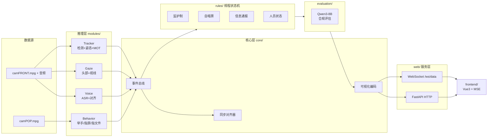

# Hedian · 核电站监护制合规检测系统

> 核电站主控室场景下的多模态合规性实时检测系统：分析 front（正面）与 pop（操作盘）两路音视频，判定操作人 / 监护人是否按规程执行监护制、自唱票与信息通报，并由大模型对完整流程的多模态证据链进行合规评估，前端流式可视化呈现。

| 后端 | Python 3.10 · FastAPI · Redis Stream+Hash · ffmpeg fMP4 |
|------|------|
| 前端 | Vue 3 · TypeScript · Vite · MSE 流式播放 |
| 感知 | YOLO11 检测 · YOLO26s 姿态 · OC-SORT 跟踪 · Qwen3-ASR 语音对齐 · Qwen3-8B 评估 |
| 代码规模 | 53 个 Python 模块 / 约 10,200 行 · 19 个前端源文件 |

---

## 目录

- [系统架构](#系统架构)
- [核心能力](#核心能力)
- [环境要求](#环境要求)
- [准备资源](#准备资源)
- [部署指南](#部署指南)
- [配置参考](#配置参考)
- [接口参考](#接口参考)
- [项目结构](#项目结构)
- [故障排查](#故障排查)
- [开发说明](#开发说明)
- [许可证](#许可证)

---

## 系统架构



**关键设计点**

- **事件总线解耦**：各推理模块只向总线发布事件，规程状态机被动消费，模块可独立增删。
- **视角级 GPU 分配**：`config.yaml` 按模块指定 GPU，tracker 与 voice/behavior/evaluation 分卡，避免显存争用。
- **推理解耦常驻**：`main.py` 以子进程拉起各推理流，Web 服务常驻；进程异常不影响 HTTP 面。
- **状态可回放**：Redis 记录推理与模块状态，WebSocket 连接时补发状态快照，前端刷新即恢复进度。

---

## 核心能力

| 模块 | 能力 | 说明 |
|------|------|------|
| Tracker | 人员追踪 | 目标检测 + 姿态估计 + 多目标跟踪，输出操作人 / 监护人身份 |
| Gaze | 眼睛关注度 | 头部姿态 + 视线估计，判定是否注视关键区域 |
| Voice | 语音转录 | 字词级时间对齐 + 行业术语归一化，支撑唱票比对 |
| Behavior | 行为检测 | 举手、手指屏幕、手指文件三类关键动作 |
| Rules | 规程判定 | 监护制 / 自唱票 / 信息通报 / 人员状态 四大状态机实时研判 + 违规告警 |
| Evaluation | 合规评估 | 大模型基于完整多模态证据链输出合规结论与打分 |
| Frontend | 流式可视化 | 视频、字幕、关注度热力图、告警实时推送，断点续看 |

---

## 环境要求

| 组件 | 要求 |
|------|------|
| Python | 3.10 |
| GPU | NVIDIA + CUDA，建议单卡 24GB 起；默认配置按视角分卡 |
| Redis | 6.x+，需支持 Stream 与 Hash |
| Node | 20（仅前端构建阶段） |
| ffmpeg | 系统可用（fMP4 转封装） |

---

## 准备资源

> 以下模型权重与输入视频不包含在代码仓库内，需按指定路径自行准备。判定逻辑的权威来源为 `rules/` 源码，规程细则与设计文档需向项目方单独获取。

### 模型权重 → `models/`

| 路径 | 用途 |
|------|------|
| `detection/yolo11_MOT.pt` | 人员检测（含 MOT 跟踪头） |
| `detection/yolo26s-pose.pt` | 姿态估计 |
| `behavior/behavior_yolo.pt` | 行为检测 |
| `behavior/behavior_yolo26s-pose.pt` | 行为姿态估计 |
| `gaze/yolov8n_head.onnx` | 头部检测 |
| `gaze/gazelle_dinov3_vits16plus_finetuned_1x3x640x640_1xNx4.onnx` | 视线估计 |
| `evaluation/Qwen3-8B` | 合规评估主模型 |
| `evaluation/Qwen2.5-1.5B-Instruct` | 备用评估模型 |
| `voice/qwen/Qwen3-ASR-0___6B` | 语音转录 |
| `voice/qwen/Qwen3-ForcedAligner-0___6B` | 字词级对齐 |

- Qwen 系列为公开模型，可从 ModelScope / HuggingFace 获取。
- YOLO 系列为项目训练产物，需自行训练或使用项目方提供的权重。

> ⚠️ **命名差异**：语音模型目录名用下划线（`Qwen3-ASR-0___6B`），而 `config.yaml` 中写的是带点形式（`Qwen3-ASR-0.6B`）。下载后必须核对并统一，否则启动即报错。

### 视频与标注 → `data/`

| 路径 | 说明 |
|------|------|
| `videos/camFRONT.mpg` | 正面视角视频，操作人 / 监护人入镜 |
| `videos/camPOP.mpg` | 操作盘视角视频 |
| `videos/camFRONT_audio.wav` | 正面视角音频轨 |
| `ROI.json` | 关键区域标注，关注度判定依据 |
| `results/` | 推理结果输出目录（需可写） |

样本数据为本项目自采，无法随仓库发布。替换为自有视频后须同步修改 `config.yaml` 的 `videos.*`。

### Redis 实例

建议使用**专用 Redis**：`/start` 接口会执行 `flushdb` 清空全部 key 以保证运行幂等，请勿与业务服务共用实例。

---

## 部署指南

### 1. 获取代码

```bash
git clone <your-repo-url>
cd <your-repo-dir>
```

后续命令均在仓库根目录执行。

### 2. 安装依赖

```bash
conda create -n hedian python=3.10 -y
conda activate hedian
pip install -r requirements.txt
```

### 3. 放置资源

按 [准备资源](#准备资源) 补齐 `models/` 与 `data/`，并核对 `config.yaml` 中所有路径指向真实文件。

### 4. 启动后端

```bash
python main.py --gpu 0            # 前台，便于观察日志
python main.py --config custom.yaml --gpu 0   # 指定配置
```

常驻部署：

```bash
setsid nohup python main.py --gpu 0 > hedian.log 2>&1 < /dev/null &
```

### 5. 构建前端

```bash
cd frontend
npm install
npm run build
```

构建产物由后端以静态文件兜底方式托管，无需独立部署 Web 服务器。

### 6. 验证

```bash
curl http://127.0.0.1:5002/status      # 期望 {"pipeline":"idle", "ws_clients":0}
curl -X POST http://127.0.0.1:5002/start
curl http://127.0.0.1:5002/api/modules  # 确认各模块开关
```

浏览器访问 `http://<服务地址>:5002`。

### 停止 / 复位

```bash
curl -X POST http://127.0.0.1:5002/stop    # 终止推理子进程，切回 idle
curl -X POST http://127.0.0.1:5002/reset   # 同时清空 Redis 与可视化缓存
pkill -f main.py                            # 直接结束服务
```

---

## 配置参考

`config.yaml` 主要字段：

| 字段 | 默认 | 说明 |
|------|------|------|
| `app.port` | `5002` | Web 服务端口 |
| `app.gpu_map` | 按模块分卡 | **单卡环境请将值 `"1"` 改为 `"0"`** |
| `app.gpu_default` | `"0"` | `gpu_map` 未覆盖模块的回退值，含 CLI `--gpu` |
| `app.fps` | `30.0` | 帧率基准 |
| `redis.host` / `port` / `db` | `localhost` / `6379` / `0` | Redis 连接 |
| `paths.data_root` | `data` | 数据根目录 |
| `paths.model_root` | `models` | 模型根目录 |
| `paths.result_root` | `data/results` | 结果输出目录 |
| `videos.front` / `pop` | 见仓库 | 输入视频路径 |
| `voice.asr_engine` | `qwen3` | 语音识别引擎 |
| `voice.model_path` / `aligner_path` | 见仓库 | 语音模型路径 |
| `supervision.*` | 见仓库 | 监护制绑定的时长与距离阈值、连续帧数、告警冷却 |
| `tracker.detection.*` | 见仓库 | 检测置信度、NMS、输入尺寸 |
| `gaze.*` / `behavior.*` | 见仓库 | 关注度与行为判定的置信度、IoU、冷却参数 |
| `bus.max_queue_size` | `1024` | 事件总线队列上限 |
| `modules.*` | `true` | 各感知模块开关，未备齐资源的模块可置 `false` |
| `rules.*` | `true` | 各规程状态机开关 |

---

## 接口参考

### HTTP

| 方法 | 路径 | 说明 |
|------|------|------|
| POST | `/start` | 启动流水线。幂等：运行中重复调用返回 `already_running`；启动前 `flushdb` 清空历史 |
| POST | `/stop` | 终止推理子进程，清理 `inference:*` / `module:*` / `pipeline:*`，状态切回 idle |
| POST | `/reset` | 页面刷新场景：终止进程 + `flushdb` + 清空可视化缓存 |
| GET | `/status` | 返回 `{pipeline, ws_clients}` |
| GET | `/api/config` | 返回当前生效的完整配置 |
| GET | `/api/modules` | 返回模块开关 |
| GET | `/api/video/front` | 流式下发正面视角视频（HTTP Range 206 硬解） |
| GET | `/api/video/pop` | 流式下发操作盘视角视频 |

静态资源兜底至前端 `dist/`，并强制 `no-cache` 响应头，避免部署后取到旧产物。

### WebSocket `ws://<host>:5002/ws/data`

- **下行**：服务端推送推理事件、字幕、关注度与告警数据；连接建立时补发状态快照，刷新页面即可恢复进度。
- **上行**：客户端上报播放进度 `{ "type": "playback_progress", "current_sec": 12.5 }`，用于多端同步。

---

## 项目结构

```
├── main.py                 # 入口：拉起推理子进程 + Web 常驻
├── config.yaml             # 全部运行参数
├── requirements.txt        # Python 依赖
│
├── core/                   # 事件总线 / 推理流 / 同步对齐 / 可视化编码
├── modules/                # 感知层：voice / tracker(+gaze) / behavior
├── rules/                  # 规程状态机：监护制 / 自唱票 / 信息通报 / 人员状态
├── evaluation/             # 评估层：大模型评估 / 数据提取 / 流程管理
├── web/                    # 服务层：HTTP / WebSocket / 可视化转发
│
├── frontend/
│   ├── src/media/          # MSE 缓冲 / 播放调度 / 同步 / 保留窗口 / 指标
│   ├── src/composables/    # 字幕、播报、滚动、报表、打字机等组合式逻辑
│   ├── src/components/     # 视频 / 语音 / 告警 / 报表 / 头部面板
│   └── src/api/            # 管线接口封装
│
├── models/                 # 模型权重（自备）
└── data/                   # 视频与结果（自备）
```

---

## 故障排查

| 现象 | 排查方向 |
|------|----------|
| 启动即报模型路径不存在 | 核对 `voice.model_path` / `aligner_path` 与实际目录名是否一致（下划线 vs 点号） |
| `/api/video/front` 返回 404 | `data/videos/` 下缺少 `camFRONT.mp4` 或 `.mpg` |
| 显存溢出 / 进程被杀 | 未做单卡改造：把 `gpu_map` 中的 `"1"` 改为 `"0"`，或关闭 `modules.*` 中的高耗模块 |
| 前端刷新后进度丢失 | Redis 连接失败；检查 `redis.*` 与实例可用性 |
| 前端一直转圈 | 后端未在运行，或端口与 `app.port` 不一致 |
| 告警阈值不符合现场 | 调整 `supervision.*`、`gaze.*`、`behavior.*` 阈值后重启 |
| 取到旧版前端 | 确认已重新 `npm run build`，且产物位于后端静态兜底目录 |

---

## 开发说明

- **依赖变更**：修改 `requirements.txt` 后需在干净环境验证一次完整启动。
- **配置变更**：新增运行参数须同步写入本 README 的配置参考表，避免文档与实现漂移。
- **新增模块**：在 `modules/` 下实现并发布事件，在 `config.yaml` 增加 `modules.*` 开关，本 README 的能力表同步补充。
- **接口变更**：新增或调整 HTTP / WebSocket 契约，须同步更新上方接口参考表。
- **提交规范**：遵循 Conventional Commits，如 `feat(rules): ...`、`fix(web): ...`、`docs(readme): ...`。

---

## 许可证

Internal project. 未经许可不得外传。
